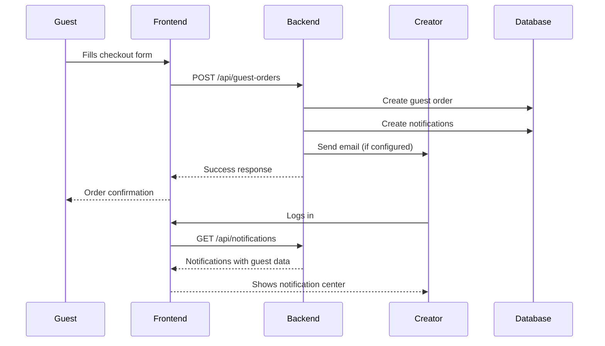

# Product Creator Notification System

## Overview
This system automatically notifies product creators when guests place orders for their products. Creators can view detailed guest information and manage orders through a dedicated notification interface.

## How It Works

### 1. Guest Places Order
- Guest fills out checkout form with contact details
- Order is submitted to `/api/guest-orders`
- System processes order and identifies product creators

### 2. Automatic Notifications
- **Database Notifications**: Created for each product creator
- **Email Notifications**: Sent when email service is configured
- **Real-time Updates**: Notification count updates in navigation

### 3. Creator Notification Data
Each notification includes:
- Guest contact information (name, email, phone, address)
- Order details (order number, items, total)
- Special notes or delivery instructions
- Product information

## Frontend Features

### Navigation Badge
- Red notification badge shows unread count
- Updates every 30 seconds automatically
- Visible to sellers and admins

### Notification Center (`/creator/notifications`)
- **List View**: All notifications with filtering options
- **Detail View**: Complete guest order information
- **Actions**: Mark as read, delete notifications
- **Filters**: All, Unread, Guest Orders

### Guest Order Details
When a creator clicks a guest order notification, they see:

#### Customer Information
- **Name**: Full guest name
- **Email**: Clickable email link
- **Phone**: Clickable phone link  
- **Address**: Complete delivery address
- **Notes**: Special delivery instructions

#### Order Information
- **Order Number**: Unique identifier (GO-XXXXXXX)
- **Items**: List of ordered products with quantities
- **Total**: Order total amount
- **Date**: When order was placed

#### Contact Actions
- Click email to send message
- Click phone to call
- View full address for delivery

## Backend Implementation

### Database Tables

#### `notifications`
```sql
- id (primary)
- user_id (creator who receives notification)
- type ('guest_order', 'order_update', etc.)
- title (notification title)
- message (notification message)
- data (JSON with guest order details)
- is_read (boolean)
- created_at, updated_at
```

#### `guest_orders`
```sql
- id, order_number
- guest_name, guest_email, guest_phone
- guest_address, guest_city, guest_postal_code
- guest_notes
- subtotal, tax, total
- status ('pending', 'confirmed', etc.)
```

#### `guest_order_items`
```sql
- id, guest_order_id, product_id
- product_name, quantity, price, total
```

### API Endpoints

#### Public
- `POST /api/guest-orders` - Create guest order

#### Protected (Creators/Admins)
- `GET /api/notifications` - List notifications
- `GET /api/notifications/unread-count` - Get unread count
- `PUT /api/notifications/{id}/read` - Mark as read
- `PUT /api/notifications/read-all` - Mark all as read
- `DELETE /api/notifications/{id}` - Delete notification
- `GET /api/guest-orders` - List guest orders
- `GET /api/guest-orders/{id}` - Get order details
- `PUT /api/guest-orders/{id}/status` - Update order status

## Notification Flow



## Security Features

### Access Control
- Only product creators see notifications for their products
- Admins can see all notifications
- Guest orders are public for creation, private for viewing

### Data Protection
- Guest contact information only shared with relevant creators
- Secure API endpoints with authentication
- Input validation and sanitization

## Email Integration (Optional)

When email service is configured:

### Email Content
- Guest order details
- Customer contact information  
- Order items and total
- Delivery notes

### Email Template Variables
```php
$guest_name, $guest_email, $guest_phone
$guest_address, $guest_city, $guest_postal_code
$order_number, $items, $total
$guest_notes
```

## Testing

### Test Guest Order
```bash
php test_guest_order_simple.php
```

### Expected Output
- Order created successfully
- Notifications generated for creators
- Guest contact information stored

## Frontend Integration

### Components Used
- `NavBar.jsx` - Notification badge and count
- `Creator/Notifications.jsx` - Full notification interface
- `GuestCheckout.jsx` - Guest order form

### State Management
- Real-time notification count updates
- Automatic polling every 30 seconds
- Event-driven updates for new notifications

## Future Enhancements

### Possible Features
- **SMS Notifications**: Text message alerts for creators
- **Push Notifications**: Browser push notifications
- **Order Tracking**: Status updates for guests
- **Auto-response**: Automatic reply to guest orders
- **Analytics**: Notification performance metrics

### Improvements
- **Bulk Actions**: Mark multiple notifications as read
- **Search**: Filter notifications by customer name
- **Export**: Download guest order data
- **Templates**: Custom notification templates

## Troubleshooting

### Common Issues

#### Notifications Not Showing
1. Check user role (must be seller or admin)
2. Verify product ownership
3. Check API authentication

#### Guest Order Not Creating
1. Verify all required fields
2. Check product exists
3. Validate email format

#### Email Not Sending
1. Configure email service
2. Check SMTP settings
3. Verify email templates

### Debug Information
- Laravel logs: `storage/logs/laravel.log`
- Database: Check `notifications` table
- API: Test endpoints directly

## Support

For issues with the notification system:
1. Check Laravel logs for errors
2. Verify database connections
3. Test API endpoints manually
4. Review frontend console errors
